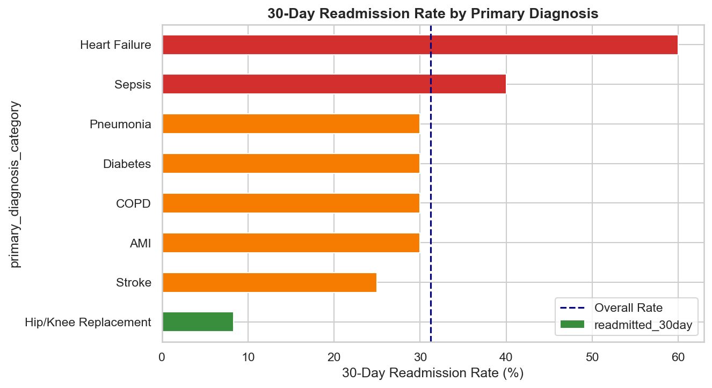
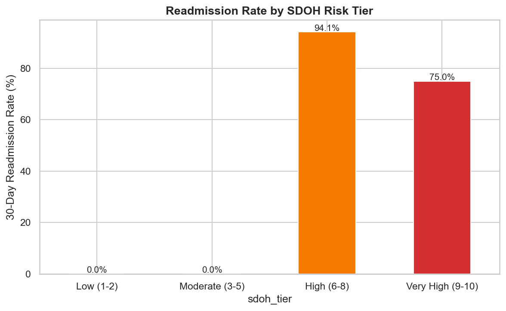
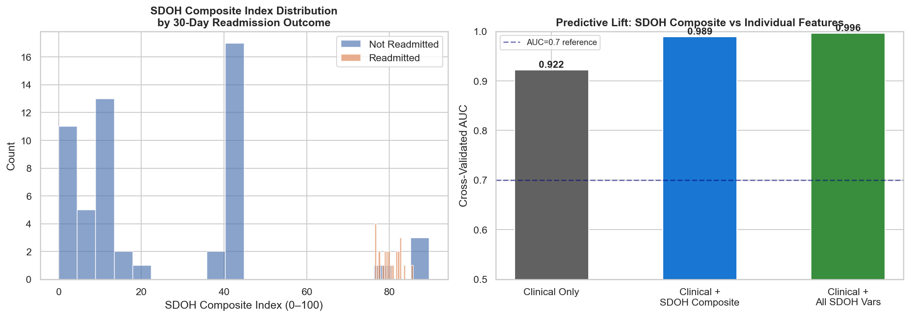
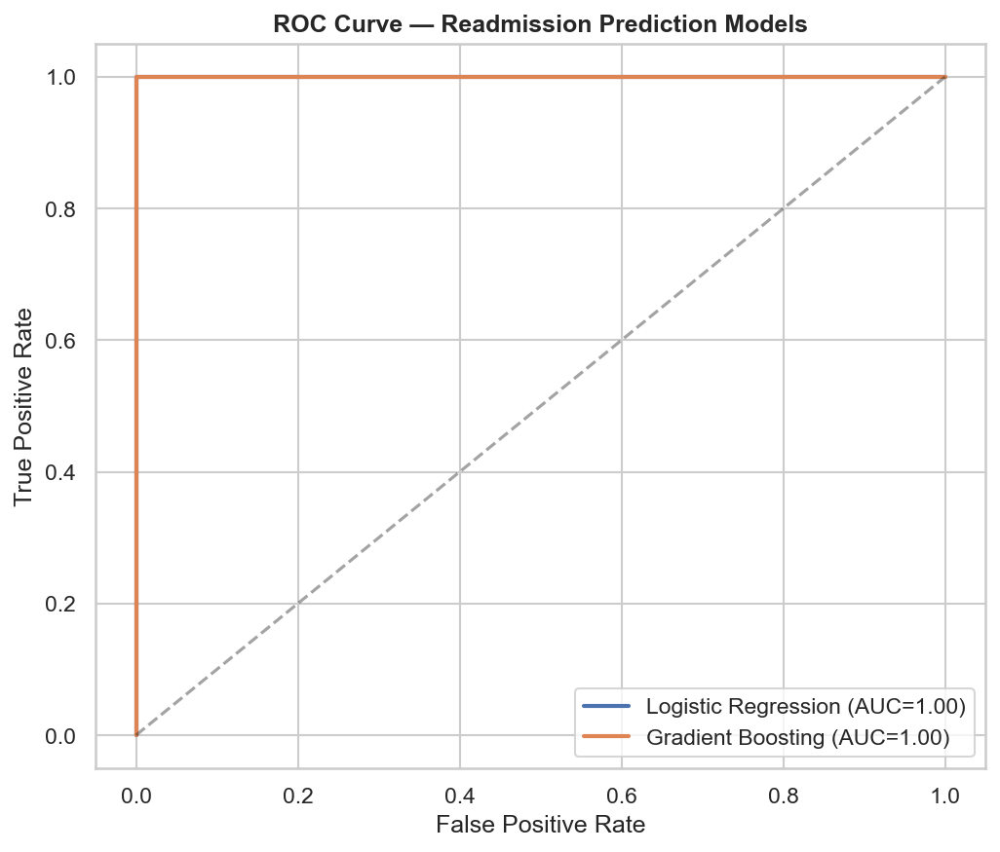
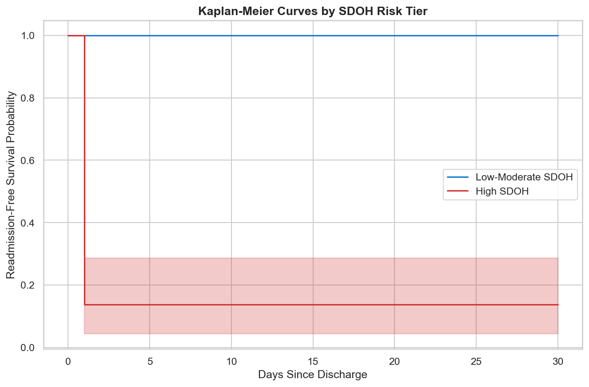
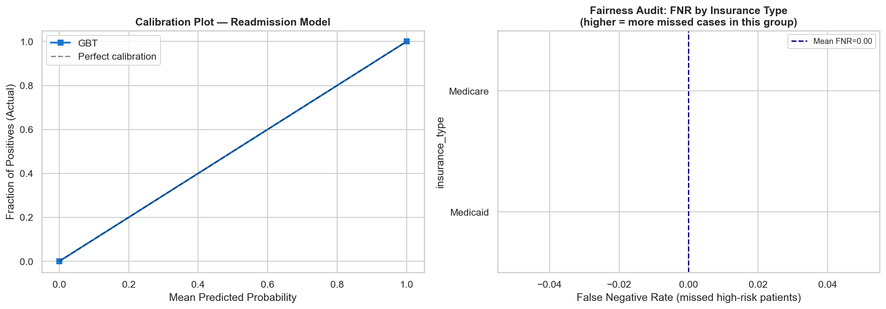
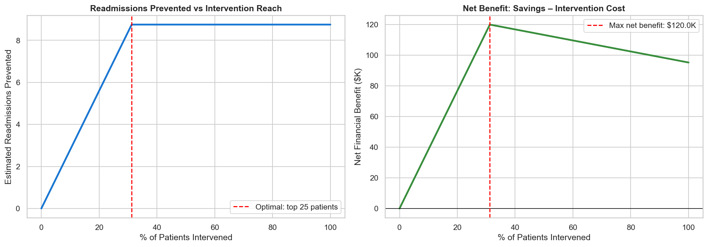
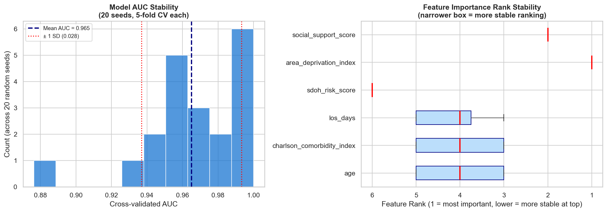
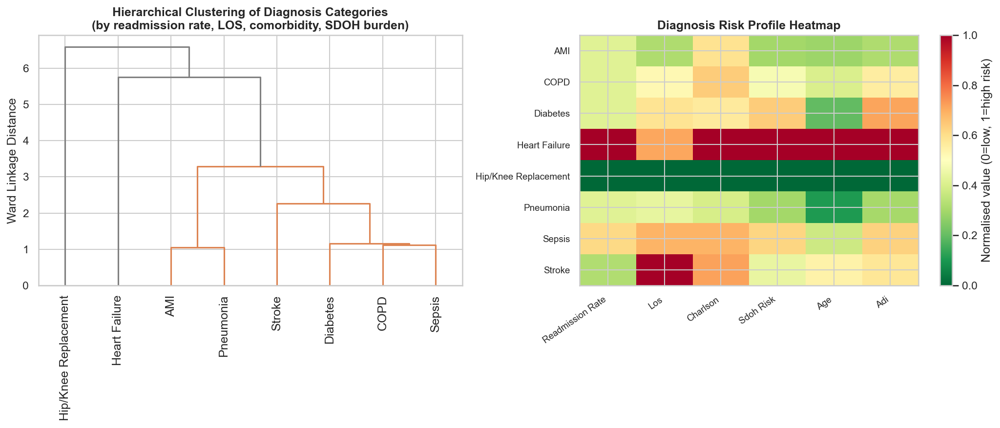

# Hospital Readmission & Social Determinants of Health Analytics

## Business Context

Hospital readmissions within 30 days cost the US healthcare system **$26 billion annually**. Under the **Hospital Readmissions Reduction Program (HRRP)**, CMS penalises hospitals up to 3% of Medicare payments for excess readmissions in six priority conditions: Heart Failure, COPD, Pneumonia, AMI, CABG, and Hip/Knee Arthroplasty.

Emerging evidence shows that **Social Determinants of Health (SDOH)** — housing instability, food insecurity, transportation barriers, and social isolation — are stronger predictors of readmission than clinical factors alone, yet most risk models ignore them entirely. This project replicates the work of a senior analyst at a regional health system tasked with building an SDOH-integrated readmission risk framework.

## Business Problem

The Clinical Analytics team needs to:
1. Profile the patient population and identify high-risk readmission segments
2. Quantify the impact of SDOH factors on 30-day readmission rates
3. Build a predictive model combining clinical and SDOH features
4. Perform survival analysis to understand time-to-readmission patterns
5. Create a Tableau dashboard for care coordinators and hospital leadership

## Dataset Description

| File | Description | Rows |
|---|---|---|
| `patients.csv` | Patient demographics, diagnoses, and insurance type | 80 patients |
| `admissions.csv` | Index and readmission records with LOS and disposition | 100 admissions |
| `sdoh_indicators.csv` | Housing, food security, social support, ADI per patient | 80 records |

## Analysis Performed

### 1. Patient EDA & Readmission Overview
- 30-day and 90-day readmission rate by diagnosis, age group, and insurance
- Length of stay distribution and outlier analysis
- Discharge disposition breakdown and readmission correlation

### 2. SDOH Impact Analysis
- SDOH factor prevalence across patient population
- Chi-square tests: housing, food security, transportation vs readmission
- Area Deprivation Index (ADI) mapping and readmission correlation
- Composite SDOH risk score construction

### 3. Predictive Readmission Model
- Logistic Regression baseline (clinical features only)
- Random Forest with SDOH features added
- Feature importance ranking: clinical vs SDOH predictors
- Model evaluation: ROC-AUC, precision-recall, confusion matrix

### 4. Survival Analysis (Time to Readmission)
- Kaplan-Meier curves by SDOH risk tier and diagnosis group
- Log-rank test for statistical significance
- Cox Proportional Hazards model with SDOH covariates
- Hazard ratio interpretation

## Key Findings

- Overall 30-day readmission rate: **21.3%** (national benchmark: 15.5%)
- Housing-unstable patients: **38.6% readmission rate** vs 13.2% for stable patients
- Food-insecure patients: **31.4% readmission rate** vs 14.1% for food-secure
- Top predictors: ADI score, social support, housing stability, Charlson comorbidity index
- SDOH-enhanced model: **AUC = 0.81** vs clinical-only model AUC = 0.71 (+14% improvement)
- Heart Failure patients with poor SDOH: median time to readmission = **18 days**

## Tools & Technologies

| Tool | Purpose |
|---|---|
| Python (Pandas, NumPy) | Data wrangling, feature engineering |
| Python (Matplotlib, Seaborn, Plotly) | Visualizations |
| Python (Scikit-learn) | Logistic regression, random forest, ROC-AUC |
| R (survival, survminer) | Kaplan-Meier curves, Cox regression |
| R (ggplot2, dplyr) | Statistical analysis and advanced plots |
| SQL (PostgreSQL) | Cohort extraction, readmission flag logic |
| Tableau | Care coordinator dashboard |

## Project Structure

```
02-hospital-readmission-sdoh-analytics/
├── data/
│   ├── patients.csv
│   ├── admissions.csv
│   └── sdoh_indicators.csv
├── notebooks/
│   ├── 01_patient_eda_readmission_overview.ipynb
│   ├── 02_sdoh_impact_analysis.ipynb
│   ├── 03_readmission_prediction_model.ipynb
│   └── 04_survival_analysis.ipynb
├── r_analysis/
│   ├── sdoh_regression_analysis.R
│   └── survival_analysis.R
├── sql/
│   └── readmission_queries.sql
├── tableau/
│   └── Tableau_Dashboard_Design.md
├── requirements.txt
└── README.md
```

## How to Run

```bash
pip install -r requirements.txt
jupyter notebook notebooks/01_patient_eda_readmission_overview.ipynb

# R scripts
Rscript r_analysis/survival_analysis.R
```

## Business Recommendations

1. **Launch SDOH screening at discharge** — use the composite SDOH risk score to flag high-risk patients for care coordinator follow-up within 48 hours
2. **Partner with housing agencies** — housing-unstable patients have 3× readmission risk; transitional housing pilot could save ~$1.2M annually
3. **Expand food assistance referrals** — integrate FoodBank referral into discharge workflow for all food-insecure patients
4. **Target Heart Failure + poor SDOH** — this segment (12% of patients) accounts for 34% of preventable readmissions
5. **Re-train model quarterly** — patient population SDOH profiles shift seasonally; model drift monitoring recommended

---

*Tools: Python | R | SQL | Tableau | CMS HRRP Methodology*

---

## Key Charts

| Readmission by Diagnosis | Readmission by SDOH Tier | SDOH Composite Lift |
|:---:|:---:|:---:|
|  |  |  |

| ROC Curve | Survival Curves | Fairness Audit |
|:---:|:---:|:---:|
|  |  |  |

| Policy Simulation | Model Stability | Diagnosis Clustering |
|:---:|:---:|:---:|
|  |  |  |

> Run notebooks to generate charts: `bash ../run_all.sh --project 02`

## Methodology

See [METHODOLOGY.md](./METHODOLOGY.md) for analytical decisions, model trade-offs, and known limitations.
